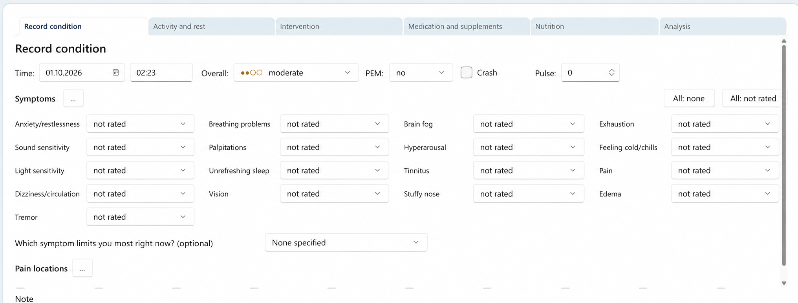
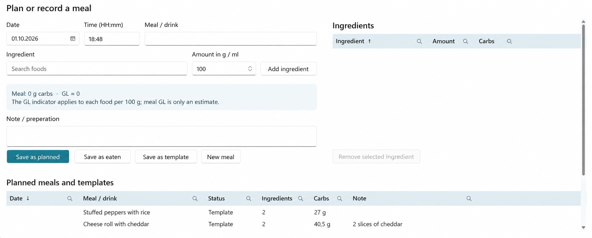
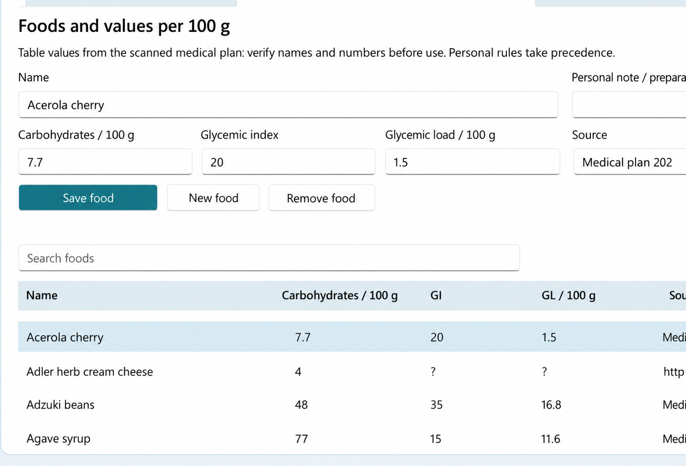
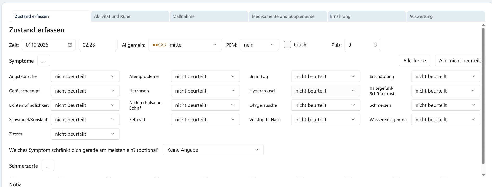
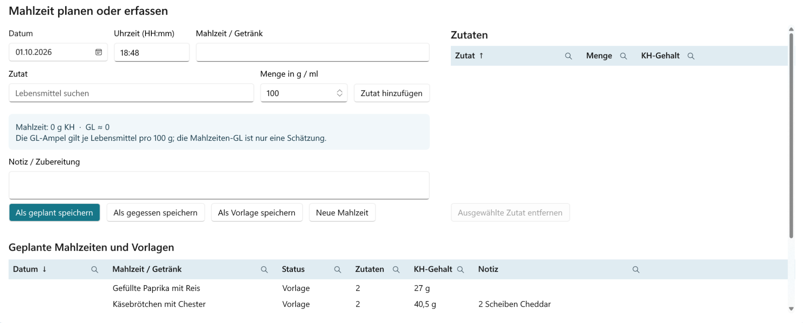
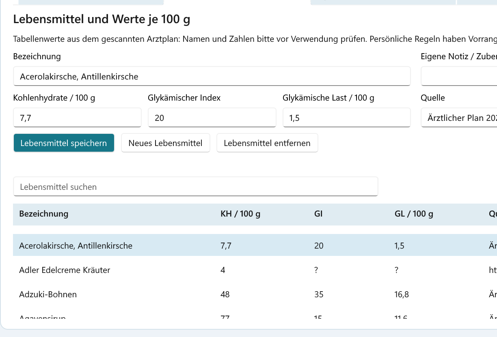

# Pace Atlas

**Track life with ME/CFS, recognize patterns, and pace more deliberately.**

[Deutsch](#deutsch)

Pace Atlas is a Windows application for people with ME/CFS. It brings symptoms,
activities, rest, interventions, medication, and nutrition together in a
timeline. Its analyses help you spot your own patterns, such as activities that
preceded post-exertional malaise (PEM). Your entries are stored in a local
SQLite database.

> “Can I do what I am doing twice in a row?” If the answer is “no,” don't do it.

## What you can do with Pace Atlas

- **Record your condition and symptoms:** Document your overall condition, PEM,
  crashes, pulse, individual symptoms, and pain locations.
- **Keep track of exertion and recovery:** Record activities, rest, and sleep,
  including duration, intensity, types of exertion, and protective measures.
  A pacing timer reminds you to take breaks.
- **Manage interventions and medication:** Note interventions and their effects,
  mark doses as taken in the daily log, and monitor packages and supplies.
- **Record meals and foods:** Bring together planned and eaten meals, templates,
  carbohydrates, and available glycemic index (GI) and glycemic load (GL) values.
- **Explore your history:** View charts, heatmaps, symptom trends, and PEM risks.
  A local interpretation and an optional configurable AI connection are also
  available.

## A look at the interface

These English views are translated adaptations of screenshots from a development
version. Layout and labels may change in later versions.

### Record your condition



### Plan or record a meal



### Foods and nutritional values



## Try it

Pace Atlas runs on **Windows x64**. If a ready-made installer is available,
you can find it under [Releases](https://github.com/sebibasti0815/PaceAtlas/releases).
You can also build the application from source; see [Running from source](#running-from-source).
**Pace Atlas itself is completely free for noncommercial use.**

---

## Project, license, and technical notes

The `PaceAtlas.sln` solution contains the Windows UI in `PaceAtlas.WinUI` and
`PaceAtlas.Core`. The older WinForms source in `PaceAtlas/` still supplies shared
resources and translations, so all three project directories must remain together.

### License

Pace Atlas is licensed under the [PolyForm Noncommercial License 1.0.0](LICENSE).
Noncommercial use, modification, and redistribution are permitted under its
terms. Commercial use requires separate permission from the rights holder. This
applies to the application code; BLS data, imported Open Food Facts data, and
third-party components have their own licenses (see `THIRD-PARTY-NOTICES.md` and
`LICENSE-OPEN-FOOD-FACTS.md`).

### Running from source

Use Visual Studio with the WinUI workload, the .NET 10 SDK, and Windows SDK
10.0.26100 or newer. Open `PaceAtlas.sln` and select `PaceAtlas.WinUI` as the
startup project. Alternatively:

```powershell
dotnet run --project .\PaceAtlas.WinUI\PaceAtlas.WinUI.csproj
```

The application targets Windows x64 and requires .NET Desktop Runtime 10 and
Windows App SDK Runtime 1.8. Both user interfaces use the database at
`%LOCALAPPDATA%\PaceAtlas\paceatlas.db`.
Launching the WinUI application again activates its existing window, including
when it is hidden in the system tray.
If the first window takes more than 500 ms to appear, a borderless splash screen
shows the large logo and application name on a background matching the app
header. Once shown, it remains visible for at least 1.5 seconds. Startup stages
are logged to `%LOCALAPPDATA%\PaceAtlas.WinUI\startup-timing.log` on these starts.
When closing the window, a dialog offers to minimize to the tray, quit, or
cancel. “Always use this choice today” remembers the tray or quit choice until
the next local calendar day. The tray menu's explicit quit command is unaffected.

### Installer

Provide Inno Setup 6 and the signed runtime installers described in
`installer/prerequisites/README.md`. Build the `Installer|x64` configuration in
Visual Studio or run:

```powershell
powershell -ExecutionPolicy Bypass -File .\installer\build-installer.ps1
```

The installer is written to
`artifacts\installer\PaceAtlas-Setup-<Version>-win-x64.exe`. The installer identity
is preserved. An upgrade removes the old `PaceAtlas.WinUIPrototype.exe`, installs
`PaceAtlas.WinUI.exe`, and updates shortcuts.

### Settings and data

WinUI settings are stored in `%LOCALAPPDATA%\PaceAtlas.WinUI`. On first launch,
existing language, window position, tab order, column widths, filters, tray,
and update settings are copied from `%LOCALAPPDATA%\PaceAtlas.WinUIPrototype`
where no corresponding file exists at the new location. The previous settings
directory remains available as a fallback. The shared database is not moved.

The information dialog and automatic daily check read published releases from
`https://github.com/sebibasti0815/PaceAtlas`. A higher regular version tag may
trigger an update offer; installation and data migration are not automatic.

### Offline BLS catalog

The embedded `PaceAtlas.Core/Bls4Catalog.tsv.gz` catalog was derived from the
German Nutrient Database (Bundeslebensmittelschlüssel) 4.0: Max Rubner-Institut
(2025), *Bundeslebensmittelschlüssel (BLS), Version 4.0 — Deutsche
Nährstoffdatenbank*, Karlsruhe,
DOI: https://doi.org/10.25826/Data20251217-134202-0.
License: Creative Commons Attribution 4.0 International (CC BY 4.0),
https://creativecommons.org/licenses/by/4.0/.
Full attribution and license information is in `THIRD-PARTY-NOTICES.md` and
the application's information dialog. Original data: https://blsdb.de/download.
The file contains all 7,140 foods, nutrient values, and provenance data. To
recreate it, run `tools/build-bls-catalog.py` with the official Excel file as
input. Personal entries are stored separately in `foods`; the BLS catalog is
loaded offline on a new installation.

Smaller project archives may omit `Bls4Catalog.tsv.gz`. The application will
continue to work on an existing user profile where the BLS catalog has already
been imported. For a new installation, the complete project package including
the data file must be built and launched once. In the food tab, “Check for BLS
updates” checks the official download file; the application also checks at
startup at most once per day. A changed download is reported but is not
imported into the local database without review.

### Importing Open Food Facts

The official tab-separated CSV export, also available as `.gz`, can be obtained
from https://world.openfoodfacts.org/data. In **Nutrition → Foods**, click
**Import Open Food Facts** and select that file. The full export is large, so
reading it and initially loading the food list may take time. Products with a
German name, a carbohydrate value, and a connection to Germany are stored in a
separate SQLite table. The importer uses `product_name_de` or, when the main
language is `de`, the generic product name. If the CSV lacks a language field,
the existing product name is used for products associated with Germany; in
individual cases, it may be in another language.

Before saving, HTML entities in names are decoded; leading parenthesized
numbers and stray characters, package weights, and prices are removed; and
whitespace is normalized. The original capitalization of product and brand
names is retained. Percentage values such as “5% fat” remain. The barcode is
kept in the source information rather than the name. Obvious duplicates with
the same normalized display name are merged even if nutritional values or
barcodes differ. The record with more available nutrient fields wins; ties
retain the first record read. Values from different products are not combined.
Other languages are not translated automatically.

Repeating the import with a newer export replaces the entire previous Open Food
Facts import in one transaction. Personal additions remain intact. The export
file is not distributed with the project archive and must be imported again on
a new user profile. Search ignores accents and punctuation, finds words in any
order, and tolerates one typo in longer terms. Attribution and license details
are in the information dialog and `LICENSE-OPEN-FOOD-FACTS.md`.

During import, the UI shows the number of rows checked and a cancel button.
Canceling rolls back the current transaction, leaving the previous catalog
intact. If you close the application during import, it asks first and waits
for a controlled cancellation before quitting.

---

## Deutsch

**Den eigenen Alltag mit ME/CFS erfassen, Zusammenhänge erkennen und Pacing bewusster gestalten.**

Pace Atlas ist eine Windows-Anwendung für Menschen mit ME/CFS. Sie verbindet
Zustand und Symptome mit Aktivitäten, Ruhezeiten, Maßnahmen, Medikamenten und
Ernährung in einem zeitlichen Verlauf. Die Auswertungen helfen dir, deine
eigenen Muster zu entdecken – zum Beispiel, welche Belastungen einem PEM
vorausgingen. Deine Einträge liegen in einer lokalen SQLite-Datenbank.

> „Kann ich das, was ich tue, zweimal hintereinander tun?“ – Ist die Antwort „nein“, tue es nicht.

## Was du mit Pace Atlas machen kannst

- **Zustand und Symptome festhalten:** Allgemeinzustand, PEM, Crash, Puls,
  einzelne Symptome und Schmerzorte dokumentieren.
- **Belastung und Erholung im Blick behalten:** Aktivitäten, Ruhe und Schlaf mit
  Dauer, Intensität, Belastungsarten und Schutzmaßnahmen erfassen. Ein Pacing
  Timer erinnert an Pausen.
- **Maßnahmen und Medikamente verwalten:** Maßnahmen mit Anlass und Verlauf
  notieren, Einnahmen im Tagesprotokoll abhaken und Packungen sowie Vorräte
  überblicken.
- **Mahlzeiten und Lebensmittel erfassen:** Geplante und gegessene Mahlzeiten,
  Vorlagen, Kohlenhydrate sowie vorhandene GI- und GL-Werte zusammenführen.
- **Den Verlauf auswerten:** Diagramme, Heatmaps, Symptomverläufe und
  PEM-Risiken betrachten. Ergänzend gibt es eine lokale Einordnung und eine
  optional konfigurierbare KI-Anbindung.

## Einblicke in die Oberfläche

Die Bilder zeigen Ausschnitte aus einer Entwicklungsversion. Anordnung und
Beschriftungen können sich in neueren Versionen unterscheiden.

### Zustand erfassen



### Mahlzeiten planen oder erfassen



### Lebensmittel und Nährwerte



## Ausprobieren

Pace Atlas läuft unter **Windows x64**. Falls ein fertiges Setup veröffentlicht
ist, findest du es bei den [Releases](https://github.com/sebibasti0815/PaceAtlas/releases).
Du kannst die Anwendung auch aus dem Quellcode bauen; die Anleitung steht
[weiter unten](#starten). **Pace Atlas selbst ist für die nichtkommerzielle
Nutzung vollständig kostenfrei.**

---

## Projekt, Lizenz und technische Hinweise

Die Projektmappe `PaceAtlas.sln` enthält die Windows-Oberfläche `PaceAtlas.WinUI` und `PaceAtlas.Core`. Der ältere WinForms-Quellcode unter `PaceAtlas/` liefert weiterhin gemeinsam verwendete Ressourcen und Übersetzungen. Deshalb müssen alle drei Projektordner nebeneinander bleiben.

### Lizenz

Pace Atlas steht unter der [PolyForm Noncommercial License 1.0.0](LICENSE).
Nichtkommerzielle Nutzung, Bearbeitung und Weitergabe sind nach deren Bedingungen
erlaubt. Für kommerzielle Nutzung ist eine gesonderte Erlaubnis des
Rechteinhabers erforderlich. Dies gilt für den Programmcode; BLS-Daten,
importierte Open-Food-Facts-Daten und Komponenten Dritter unterliegen ihren
jeweiligen eigenen Lizenzbedingungen (siehe `THIRD-PARTY-NOTICES.md` und
`LICENSE-OPEN-FOOD-FACTS.md`).

### Starten

Visual Studio mit WinUI-Workload, .NET 10 SDK und Windows SDK 10.0.26100 oder neuer verwenden. `PaceAtlas.sln` öffnen und `PaceAtlas.WinUI` als Startprojekt auswählen. Alternativ:

```powershell
dotnet run --project .\PaceAtlas.WinUI\PaceAtlas.WinUI.csproj
```

Die Anwendung ist für Windows x64 ausgelegt und benötigt .NET Desktop Runtime 10 und Windows App SDK Runtime 1.8. Beide Oberflächen verwenden die Datenbank `%LOCALAPPDATA%\PaceAtlas\paceatlas.db`.
Ein erneuter Start der WinUI-Anwendung aktiviert das bereits laufende Fenster und holt es gegebenenfalls aus dem Tray zurück.
Wenn der erste Fensteraufbau länger als 500 ms dauert, erscheint ein rahmenloser Ladebildschirm in der Farbe des Programmheaders mit großem Logo und einem rechts davon zentrierten Anwendungsnamen. Sobald er sichtbar ist, bleibt er mindestens 1,5 Sekunden stehen. Die Dauer einzelner Startabschnitte wird bei solchen Starts in `%LOCALAPPDATA%\PaceAtlas.WinUI\startup-timing.log` protokolliert.
Beim Schließen des Fensters bietet ein Dialog die Auswahl zwischen dem Tray, dem Beenden der Anwendung und Abbrechen.
Mit „Für heute immer diese Auswahl“ wird „Ins Tray“ oder „Beenden“ bis zum nächsten lokalen Kalendertag gespeichert. Der ausdrückliche Befehl „Beenden“ im Tray-Menü bleibt davon unabhängig.

### Installer

Inno Setup 6 und die signierten Laufzeitinstaller aus `installer/prerequisites/README.md` bereitstellen. In Visual Studio `Installer|x64` bauen oder ausführen:

```powershell
powershell -ExecutionPolicy Bypass -File .\installer\build-installer.ps1
```

Das Setup erscheint unter `artifacts\installer\PaceAtlas-Setup-<Version>-win-x64.exe`. Die bestehende Installer-Kennung bleibt erhalten. Ein Upgrade entfernt die alte EXE `PaceAtlas.WinUIPrototype.exe`, legt `PaceAtlas.WinUI.exe` an und aktualisiert die Verknüpfungen.

### Einstellungen und Daten

Die WinUI-Einstellungen liegen nun unter `%LOCALAPPDATA%\PaceAtlas.WinUI`. Beim ersten Start werden vorhandene Sprache, Fensterposition, Tab-Reihenfolge, Spaltenbreiten, Filter, Tray- und Update-Einstellungen aus `%LOCALAPPDATA%\PaceAtlas.WinUIPrototype` übernommen, sofern am neuen Ort noch keine entsprechende Datei existiert. Der alte Einstellungsordner bleibt als Rückfallmöglichkeit erhalten. Die gemeinsame Datenbank wird dabei nicht verschoben.

Der Info-Dialog und die automatische tägliche Prüfung lesen die veröffentlichten Releases von `https://github.com/sebibasti0815/PaceAtlas`. Ein höheres reguläres Versions-Tag kann ein Update anbieten; Installation und Datenübernahme erfolgen nicht automatisch.

### BLS-Offlinekatalog

Der eingebettete Katalog `PaceAtlas.Core/Bls4Catalog.tsv.gz` wurde aus dem
Bundeslebensmittelschlüssel 4.0 erstellt: Max Rubner-Institut (2025),
*Bundeslebensmittelschlüssel (BLS), Version 4.0 — Deutsche Nährstoffdatenbank*,
Karlsruhe, DOI: https://doi.org/10.25826/Data20251217-134202-0.
Lizenz: Creative Commons Namensnennung 4.0 International (CC BY 4.0),
https://creativecommons.org/licenses/by/4.0/.
Die ausführlichen Quellen- und Lizenzangaben stehen in `THIRD-PARTY-NOTICES.md`
und im Infodialog der Anwendung.
Originaldaten: https://blsdb.de/download.
Die Datei enthält alle 7.140 Lebensmittel sowie Nährstoffwerte und deren
Herkunftsangaben. Zur Reproduktion dient `tools/build-bls-catalog.py` mit der
offiziellen Excel-Datei als Eingabe. Persönliche Angaben liegen getrennt in
`foods`; der BLS-Bestand wird auf einer neuen Installation offline eingespielt.

Kleinere Projektarchive dürfen `Bls4Catalog.tsv.gz` auslassen. Die Anwendung
funktioniert damit auf einem bestehenden Benutzerprofil mit bereits importiertem
BLS-Katalog weiter. Für eine neue Installation muss einmal das vollständige
Projektpaket mit der Datendatei gebaut und gestartet werden. Im Lebensmittel-Tab
prüft „BLS-Aktualisierung prüfen“ die offizielle Download-Datei. Zusätzlich
geschieht dies beim Start höchstens einmal täglich. Ein geänderter Download wird
gemeldet, aber nicht ungeprüft in die lokale Datenbank importiert.

### Open Food Facts importieren

Die offizielle, tabulatorgetrennte CSV-Exportdatei (auch als `.gz`) steht unter
https://world.openfoodfacts.org/data zur Verfügung. Im Register **Ernährung →
Lebensmittel** auf **Open Food Facts importieren** klicken und diese Datei
auswählen. Der vollständige Export ist groß; Einlesen und der erste Aufbau der
Lebensmittelliste können entsprechend dauern. Produkte mit deutschem Namen,
Kohlenhydratwert und Bezug zu Deutschland werden in einer eigenen SQLite-Tabelle
gespeichert. Dafür wird `product_name_de` genutzt oder bei Hauptsprache `de`
der allgemeine Produktname. Falls die CSV keine Sprachangabe enthält, wird
für Produkte mit Deutschlandbezug der vorhandene Produktname übernommen;
dieser kann im Einzelfall fremdsprachig sein. Vor dem Speichern werden HTML-Codes
im Namen dekodiert, führende Nummern in Klammern und störende führende Zeichen
entfernt, Packungsgewichte und Preisangaben gestrichen sowie Leerzeichen
vereinheitlicht. Die ursprüngliche Groß- und Kleinschreibung von Produkt- und
Markennamen bleibt erhalten. Prozentangaben wie „5 % Fett“ bleiben erhalten. Der Strichcode bleibt in
der Quellenangabe statt im Namen. Offensichtliche Doppelungen mit gleicher
normalisierter angezeigter Bezeichnung werden zusammengefasst, auch wenn
Nährwerte oder Strichcodes abweichen. Der Datensatz mit mehr vorhandenen
Nährwertfeldern wird bevorzugt; bei Gleichstand bleibt der zuerst gelesene.
Die Werte verschiedener Produkte werden dabei nicht vermischt. Eine automatische
Übersetzung anderer Sprachen findet nicht statt. Der Import kann mit einem
neuen Export wiederholt werden und ersetzt dabei den gesamten vorherigen
OFF-Import innerhalb einer Transaktion. Persönliche Ergänzungen bleiben
erhalten. Die Exportdatei wird nicht mit dem
Projektarchiv ausgeliefert; auf einem neuen Benutzerprofil muss sie erneut
importiert werden. Die Suchfunktion ignoriert Akzente und Interpunktion,
findet Wörter unabhängig von ihrer Reihenfolge und toleriert bei längeren
Suchwörtern einen Schreibfehler. Die Quellen- und Lizenzangaben stehen im
Infodialog und in `LICENSE-OPEN-FOOD-FACTS.md`.

Während des Imports zeigt die Oberfläche die Zahl der geprüften Zeilen und
einen Abbruchknopf. Ein Abbruch verwirft die laufende Transaktion; der bisherige
Katalog bleibt erhalten. Beim Schließen während des Imports fragt die Anwendung
nach und wartet vor dem Beenden auf diesen kontrollierten Abbruch.
